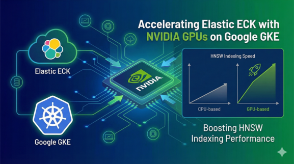
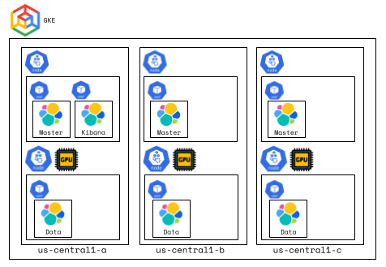
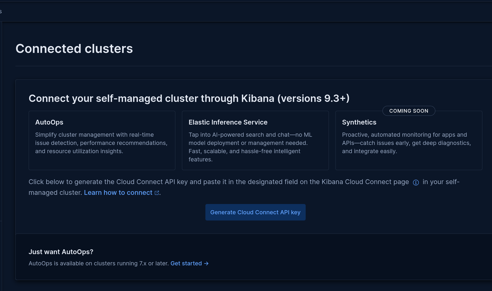
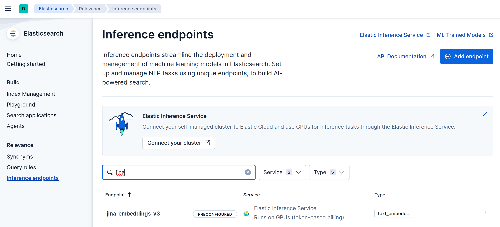

# Elastic + NVIDIA GPU Acceleration on Kubernetes
*A practical walkthrough of GPU‑accelerated vector indexing with Elasticsearch*

In this post, I walk through an end‑to‑end setup for accelerating Elasticsearch vector indexing using NVIDIA GPUs, deployed on [Google Kubernetes Engine](https://cloud.google.com/kubernetes-engine?hl=en) (GKE) with [Elastic Cloud on Kubernetes](https://www.elastic.co/docs/deploy-manage/deploy/cloud-on-k8s) (ECK).

---

## What This Article Covers

This guide focuses on the following areas:

- Provisioning a GKE cluster with both CPU‑only and GPU‑enabled node pools  
- Deploying the NVIDIA [GPU Operator](https://docs.nvidia.com/datacenter/cloud-native/gpu-operator/latest/index.html) on GKE
- Deploying an Elasticsearch cluster using ECK  
- Configuring Elasticsearch data nodes with NVIDIA [CUDA](https://developer.nvidia.com/cuda/toolkit) and [cuVS](https://developer.nvidia.com/cuvs) libraries  
- Enabling [GPU‑accelerated HNSW indexing](https://www.elastic.co/docs/reference/elasticsearch/mapping-reference/gpu-vector-indexing) in Elasticsearch  
- Configuring [Elastic Inference Service](https://www.elastic.co/docs/explore-analyze/elastic-inference/eis) (EIS) for self-managed deployments via [Cloud Connect](https://www.elastic.co/docs/explore-analyze/elastic-inference/connect-self-managed-cluster-to-eis)
- Generating a synthetic dataset with embeddings produced by a GPU‑accelerated [Jina.ai model](https://www.elastic.co/docs/explore-analyze/machine-learning/nlp/ml-nlp-jina) hosted on EIS 
- [Base64-encoding](https://www.elastic.co/search-labs/pt/blog/base64-encoded-strings-vector-ingestion) of the Jina vectors to accelerate ingest 

---

## High‑Level Architecture


At a high level, Elasticsearch is deployed on GKE using ECK. The cluster consists of two node classes:

- **CPU‑only nodes** running Elasticsearch master nodes and Kibana  
- **GPU‑enabled nodes** running Elasticsearch data nodes responsible for vector indexing  

Embeddings are generated externally using a Jina.ai model (`jina-embeddings-v3`) hosted on Elastic Inference Service.

---

## Low‑Level Architecture



The GKE cluster spans three availability zones within a single region (`us-central1`). Each zone contains:

- One CPU‑only node  
- One CPU + NVIDIA GPU node  

This layout provides fault tolerance while ensuring that GPU‑accelerated workloads remain isolated to the appropriate nodes.

---

## Provisioning the Infrastructure

### GKE Node Pools

GKE provisioning is handled using the `gcloud` CLI. The configuration below creates:

- A default CPU‑only node pool  
- A GPU‑enabled node pool using NVIDIA L4 GPUs  

To reduce cost, GPU nodes are provisioned as **spot instances**.

```bash
gcloud container clusters create gpu-demo \
    --region us-central1 \
    --node-locations us-central1-a,us-central1-b,us-central1-c \
    --num-nodes 1 \
    --machine-type e2-standard-4 \
    --disk-type pd-standard \
    --disk-size 50GB

gcloud container node-pools create gpu-pool \
    --cluster gpu-demo \
    --region us-central1 \
    --node-locations us-central1-a,us-central1-b,us-central1-c \
    --num-nodes 1 \
    --enable-autoscaling \
    --total-min-nodes 3 \
    --total-max-nodes 6 \
    --machine-type g2-standard-4 \
    --disk-type pd-ssd \
    --disk-size 100GB \
    --image-type "UBUNTU_CONTAINERD" \
    --node-labels="gke-no-default-nvidia-gpu-device-plugin=true" \
    --accelerator type=nvidia-l4,count=1 \
    --location-policy ANY \
    --spot
```

---

## Deploying the NVIDIA GPU Operator
The default GPU drivers on GKE don't support the cuVS versions necessary for integration of Elastic, so I deploy the NVIDIA GPU Operator to get a compatible driver version.
```bash
helm repo add nvidia https://helm.ngc.nvidia.com/nvidia \
    && helm repo update
helm install --wait --generate-name \
    -n gpu-operator --create-namespace \
    nvidia/gpu-operator \
    --version=v25.10.1 \
    --set toolkit.env[0].name=RUNTIME_CONFIG_SOURCE \
    --set toolkit.env[0].value=file
```
---
## Deploying Elasticsearch with ECK

### Pod Placement Strategy

The cluster consists of:

- Three Elasticsearch master pods  
- Three Elasticsearch data pods  
- One Kibana pod  

Masters and Kibana are pinned to CPU‑only nodes, while data pods are scheduled exclusively on GPU nodes using Kubernetes **taints and tolerations**. **Affinity and anti‑affinity rules** ensure pods are spread across nodes and zones.

### Elasticsearch K8S Manifest
I force a GPU requirement for the data nodes with the [parameter](https://www.elastic.co/docs/reference/elasticsearch/configuration-reference/node-settings) below. The data nodes will not start if they cannot access a GPU.
```bash
  - name: data-node
    count: 3
    config:
      node.roles: ["data", "ingest"]
      vectors.indexing.use_gpu: true
```
### cuVS Libraries
I deploy the cuVS and CUDA libs to the Elasticsearch data nodes via an init container.
```bash
        - name: install-cuvs-libs
          image: condaforge/miniforge3:latest
          volumeMounts:
            - name: lib-cache
              mountPath: /shared_libs
          securityContext:
            runAsUser: 0
            runAsNonRoot: false
          command: ["/bin/sh", "-c"]
          args:
          - |
            conda install -y -c rapidsai -c conda-forge libcuvs=25.12 cuda-version=12.5
        
            cp -L /opt/conda/lib/libstdc++.so* /shared_libs/ && \
            cp -L /opt/conda/lib/libgcc_s.so* /shared_libs/ && \

            cp -L /opt/conda/lib/libcuvs*.so* /shared_libs/ && \
            cp -L /opt/conda/lib/libcudart*.so* /shared_libs/ && \
            cp -L /opt/conda/lib/librmm*.so* /shared_libs/ && \
            cp -L /opt/conda/lib/librapids_logger*.so* /shared_libs/ && \
            cp -L /opt/conda/lib/libcublas*.so* /shared_libs/ && \
            cp -L /opt/conda/lib/libcusolver*.so* /shared_libs/ && \
            cp -L /opt/conda/lib/libcusparse*.so* /shared_libs/ && \
            cp -L /opt/conda/lib/libcurand*.so* /shared_libs/ && \
            cp -L /opt/conda/lib/libnccl*.so* /shared_libs/ && \
            cp -L /opt/conda/lib/libgomp*.so* /shared_libs/ && \
            cp -L /opt/conda/lib/libnvJitLink*.so* /shared_libs/ && \
        
            chown -R 1000:1000 /shared_libs
```
### Deployment Script

The script below installs the ECK operator, applies cluster manifests, and waits for both Elasticsearch and Kibana to reach a healthy (`green`) state.

```bash
kubectl create -f https://download.elastic.co/downloads/eck/3.3.0/crds.yaml > /dev/null 2>&1
kubectl apply -f https://download.elastic.co/downloads/eck/3.3.0/operator.yaml > /dev/null 2>&1
kubectl apply -f manifests/es.yaml
kubectl apply -f manifests/kb.yaml
```

---

## Enabling EIS for Self-Managed
EIS is enabled via Cloud Connect in Kibana.  Screenshots below show the steps.
### Cloud Console
You need a Cloud Connect API key for this integration.  This is where you generate the key.

### Kibana Cloud Connect
You put that key into the Cloud Connect screen in Kibana as shown below.

### Inference Endpoints
After configuring Cloud Connect, the EIS inference endpoints are automatically configured.


---
## Generating + Indexing the Dataset

I generate multilingual synthetic data using the Python `Faker` library. Each document consists of:

- A randomly generated multilingual paragraph  
- A corresponding embedding produced by the Jina.ai model via EIS  
- Note the use of `pack_dense_vector` to Base64-encode the Jina vector.  This provides a considerable ingest speed-up.
- In order to see meaningful indexing speed-up with GPUs, you need a dataset with millions of vectors.  For demo purposes, I'm just showing here the EIS functionality and later, that the integration between Elastic and NVIDIA was achieved.
```python
faker = Faker(['en_US', 'es_ES', 'fr_FR', 'de_DE', 'zh_CN']) 

def get_jina_embeddings(batch):
    response = es.inference.inference(input=batch, inference_id=".jina-embeddings-v3")
    return [item['embedding'] for item in response['text_embedding']]

def generate_actions():
    for _ in tqdm.tqdm(range(DATASET_SIZE // BATCH_SIZE)):
        paragraphs = [faker.paragraph() for _ in range(BATCH_SIZE)]
        embeddings = get_jina_embeddings(paragraphs)
        for paragraph, embedding in zip(paragraphs, embeddings):
            yield {
                "paragraph": paragraph, 
                "embedding": pack_dense_vector(embedding)
            }

ok, result = bulk(client=es, index=INDEX_NAME, actions=generate_actions())

```

---

## Semantic Search


Multilingual semantic search functionality is shown below:

```python
query_str = faker['de_DE'].paragraph()
query_embedding = get_jina_embeddings([query_str])[0]
response = es.search(
    index = INDEX_NAME,
    knn = {
        "field": "embedding",
        "query_vector": query_embedding,
        "k": 5
    },
    source=["paragraph"]
)
print("\nQuery:", query_str)
print("\nTop 5 results:")
for hit in response['hits']['hits']:
    score = hit['_score']
    paragraph = hit['_source']['paragraph']
    print(f"Score: {score:.4f} | Text: {paragraph[:60]}...")
```
```text
Query: Mit dauern andere der. Dein Schiff Minutenmir neun Winter. Gab Abend Mutter schwer Minute.

Top 5 results:
Score: 0.6585 | Text: Darauf Mutter bauen böse Woche. Nur Apfel baden um. Brauchen...
Score: 0.6519 | Text: Bruder schicken ein her wollen nennen. Tante fehlen von Esse...
Score: 0.6419 | Text: Toi naturel respect passé petit haute. Voiture lien marier p...
Score: 0.6245 | Text: Depuis votre voix tombe surveiller midi tout. Circonstance p...
Score: 0.6238 | Text: Natürlich ließ wollen auf dort. Dich fast Meer....
```
---

## Verification of GPU Integration
```bash
kubectl exec elastic-es-data-node-0 -c elasticsearch -- nvidia-smi
```
```text
Sat Feb  7 21:31:11 2026       
+-----------------------------------------------------------------------------------------+
| NVIDIA-SMI 580.105.08             Driver Version: 580.105.08     CUDA Version: 13.0     |
+-----------------------------------------+------------------------+----------------------+
| GPU  Name                 Persistence-M | Bus-Id          Disp.A | Volatile Uncorr. ECC |
| Fan  Temp   Perf          Pwr:Usage/Cap |           Memory-Usage | GPU-Util  Compute M. |
|                                         |                        |               MIG M. |
|=========================================+========================+======================|
|   0  NVIDIA L4                      On  |   00000000:00:03.0 Off |                    0 |
| N/A   50C    P0             34W /   72W |     308MiB /  23034MiB |      0%      Default |
|                                         |                        |                  N/A |
+-----------------------------------------+------------------------+----------------------+

+-----------------------------------------------------------------------------------------+
| Processes:                                                                              |
|  GPU   GI   CI              PID   Type   Process name                        GPU Memory |
|        ID   ID                                                               Usage      |
|=========================================================================================|
|    0   N/A  N/A             108      C   ...re/elasticsearch/jdk/bin/java        188MiB |
+-----------------------------------------------------------------------------------------+
```

---

## Source Code

The full source is available here:

https://github.com/joeywhelan/sm-gpu